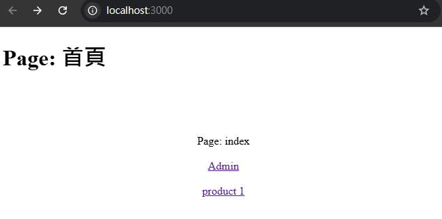

# NUXT3 - Day1 - 建立專案

### 專案建立指令

```
npx nuxi init [project name]
```

 npx nuxi init Nuxt3-Day1

### 加入目錄及頁面

```
npx nuxi add <template> <name>
```
npx nuxi add page index

### 加入後台首頁 admin/index 

```
npx nuxi add page admin/index
```

### 加入動態路由 product/[id]

```
npx nuxi add page product/[id]
```

### index 頁面使用 \<NuxtLink>

```html
<!-- pages/index.vue -->
<template>
  <div>
    <span>Page: index </span>
    <NuxtLink to="/admin" >Admin</NuxtLink>
    <NuxtLink :to="`/product/${1}`">product 1</NuxtLink>
  </div>
</template>
```

### app.vue 使用 \<NuxtPage\>

```html
<!-- app.vue -->
<template>
  <NuxtRouteAnnouncer />
  <!-- <NuxtWelcome /> -->
  <NuxtPage />
</template>
```


